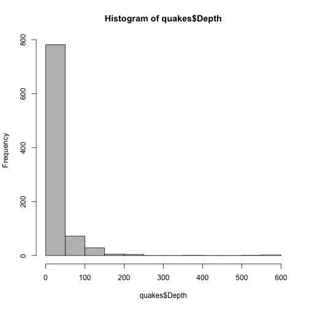
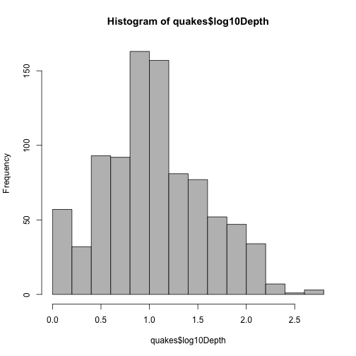
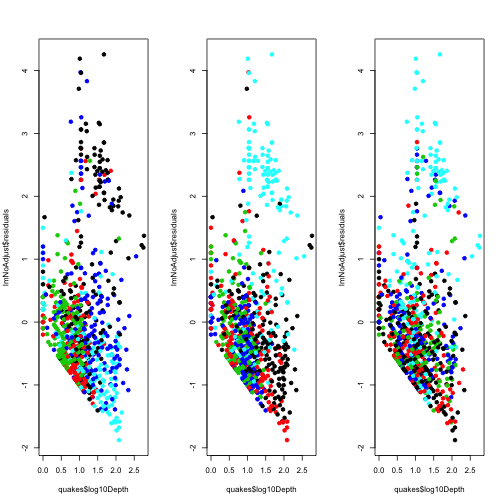
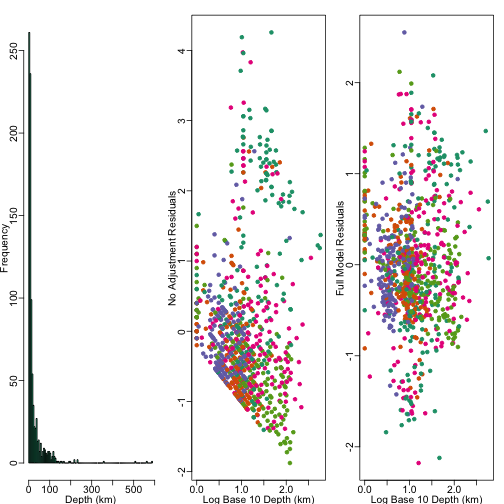

Final Earthquake Analysis
========================

Note: This analysis was created on a Mac. Some functions may be altered to be able to run on Windows machines. 

------

## Preliminaries

### Load libraries/data/create new variables


```r

# Load libraries
library(maps)
library(Hmisc)
```

```
## Loading required package: survival
```

```
## Loading required package: splines
```

```
## Hmisc library by Frank E Harrell Jr
## 
## Type library(help='Hmisc'), ?Overview, or ?Hmisc.Overview') to see overall
## documentation.
## 
## NOTE:Hmisc no longer redefines [.factor to drop unused levels when
## subsetting.  To get the old behavior of Hmisc type dropUnusedLevels().
```

```
## Attaching package: 'Hmisc'
```

```
## The following object(s) are masked from 'package:survival':
## 
## untangle.specials
```

```
## The following object(s) are masked from 'package:base':
## 
## format.pval, round.POSIXt, trunc.POSIXt, units
```

```r
library(RColorBrewer)

# Load data
load("quakesRaw.rda")

# Define relevant variables - making numeric variables into factors when
# they should be.
quakesRaw$latCut <- cut2(quakesRaw$Lat, g = 5)
quakesRaw$lonCut <- cut2(quakesRaw$Lon, g = 5)
quakesRaw$nstCut <- cut2(quakesRaw$NST, g = 5)
quakesRaw$log10Depth <- log10(quakesRaw$Depth + 1)
quakesRaw$time <- strptime(quakesRaw$Datetime, format = "%A, %B %e, %Y %H:%M:%S")

## This is the data set we will use
quakes <- quakesRaw
```


------

## Exploratory analysis

### Get minimum and maximum times and date downloaded (Methods/Data Collection)


```r
min(quakes$time)
```

```
## [1] "2013-01-24 20:24:10 EST"
```

```r
max(quakes$time)
```

```
## [1] "2013-01-31 20:19:09 EST"
```

```r
dateDownloaded
```

```
## [1] "Thu Jan 31 15:28:41 2013"
```


### Find number of missing values/check ranges (Results paragraph 1)


```r
sum(is.na(quakes))
```

```
## [1] 0
```

```r
summary(quakes)
```

```
##       Src            Eqid        Version   
##  ak     :263   00400787:  1   2      :320  
##  nc     :243   00400795:  1   1      :190  
##  ci     :125   00400804:  1   0      :145  
##  us     : 98   00400807:  1   9      : 57  
##  nn     : 47   00400817:  1   3      : 53  
##  hv     : 30   00400828:  1   4      : 37  
##  (Other): 90   (Other) :890   (Other): 94  
##                                      Datetime        Lat       
##  Monday, January 28, 2013 20:37:09 UTC   :  2   Min.   :-58.8  
##  Saturday, January 26, 2013 12:46:43 UTC :  2   1st Qu.: 34.2  
##  Sunday, January 27, 2013 17:02:54 UTC   :  2   Median : 38.8  
##  Wednesday, January 30, 2013 16:36:59 UTC:  2   Mean   : 40.0  
##  Friday, January 25, 2013 00:06:25 UTC   :  1   3rd Qu.: 54.5  
##  Friday, January 25, 2013 00:10:02 UTC   :  1   Max.   : 66.0  
##  (Other)                                 :886                  
##       Lon         Magnitude        Depth            NST       
##  Min.   :-180   Min.   :1.00   Min.   :  0.0   Min.   :  0.0  
##  1st Qu.:-148   1st Qu.:1.30   1st Qu.:  3.9   1st Qu.: 11.0  
##  Median :-122   Median :1.70   Median :  9.2   Median : 18.0  
##  Mean   :-109   Mean   :2.04   Mean   : 23.8   Mean   : 31.9  
##  3rd Qu.:-117   3rd Qu.:2.30   3rd Qu.: 23.3   3rd Qu.: 33.0  
##  Max.   : 180   Max.   :6.80   Max.   :585.2   Max.   :598.0  
##                                                               
##                  Region             latCut            lonCut   
##  Northern California:157   [-58.8,33.8):180   [-180,-150):180  
##  Central Alaska     :108   [ 33.8,37.6):179   [-150,-123):180  
##  Central California : 81   [ 37.6,38.8):179   [-123,-120):178  
##  Southern California: 76   [ 38.8,60.2):179   [-120,-116):179  
##  Southern Alaska    : 69   [ 60.2,66.0]:179   [-116, 180]:179  
##  Nevada             : 32                                       
##  (Other)            :373                                       
##       nstCut      log10Depth        time                    
##  [ 0, 11):215   Min.   :0.00   Min.   :2013-01-24 20:24:10  
##  [11, 16):173   1st Qu.:0.69   1st Qu.:2013-01-26 03:39:40  
##  [16, 24):162   Median :1.01   Median :2013-01-27 16:23:43  
##  [24, 40):168   Mean   :1.05   Mean   :2013-01-28 00:06:33  
##  [40,598]:178   3rd Qu.:1.39   3rd Qu.:2013-01-29 20:31:49  
##                 Max.   :2.77   Max.   :2013-01-31 20:19:09
```

Latitude, longitude are within normal ranges. Magnitude has nothing above 7, depth is within the defined range. 


### Look at patterns over time (Results paragraph 1)

```r
plot(quakes$time, quakes$Magnitude, pch = 19)
```

 

```r
plot(quakes$time, quakes$Depth, pch = 19)
```

 

There does not appear to be a time trend in either variable. 


### Look at distribution of magnitudes (Results paragraph 2)

```r
mean(quakes$Magnitude < 3)
```

```
## [1] 0.8549
```

```r
mean(quakes$Magnitude > 3 & quakes$Magnitude < 5)
```

```
## [1] 0.1071
```

Most earthquakes are small (< 3) or medium (>3 and < 5)

### Look at distribution of depths (Results paragraph 2)


```r
hist(quakes$Depth, col = "grey")
```

 

```r
hist(quakes$log10Depth, col = "grey")
```

 


-------

## Modeling 

### Fit a model with no adjustment (results - paragraph 3)


```r
# Fit model with no adjustment variable
lmNoAdjust <- lm(quakes$Magnitude ~ quakes$log10Depth)

# Plot residuals, colored by different variables (latitude, longitude,
# number of sites observing the quake)
par(mfrow = c(1, 3))
plot(quakes$log10Depth, lmNoAdjust$residuals, col = quakes$latCut, pch = 19)
plot(quakes$log10Depth, lmNoAdjust$residuals, col = quakes$lonCut, pch = 19)
plot(quakes$log10Depth, lmNoAdjust$residuals, col = quakes$nstCut, pch = 19)
```

 

It appears there are some non-random patterns here.


### Now fit a model with factor adjustment for latitude, longitude, and number of sites (results - paragraph 3)


```r
lmFinal <- lm(quakes$Magnitude ~ quakes$log10Depth + quakes$latCut + quakes$lonCut + 
    quakes$NST)
par(mfrow = c(1, 3))
plot(quakes$log10Depth, lmFinal$residuals, col = quakes$latCut, pch = 19)
plot(quakes$log10Depth, lmFinal$residuals, col = quakes$lonCut, pch = 19)
plot(quakes$log10Depth, lmFinal$residuals, col = quakes$nstCut, pch = 19)
```

 

Still some clumpiness of color, but much better than it was. 

## Get the estimates and confidence intervals


```r
## The estimate from summary
summary(lmFinal)
```

```
## 
## Call:
## lm(formula = quakes$Magnitude ~ quakes$log10Depth + quakes$latCut + 
##     quakes$lonCut + quakes$NST)
## 
## Residuals:
##     Min      1Q  Median      3Q     Max 
## -2.1780 -0.3977 -0.0632  0.3567  2.5521 
## 
## Coefficients:
##                            Estimate Std. Error t value Pr(>|t|)    
## (Intercept)                1.604386   0.108248   14.82  < 2e-16 ***
## quakes$log10Depth          0.406542   0.051430    7.90  8.0e-15 ***
## quakes$latCut[ 33.8,37.6) -0.349466   0.087473   -4.00  7.0e-05 ***
## quakes$latCut[ 37.6,38.8) -0.241225   0.091556   -2.63  0.00857 ** 
## quakes$latCut[ 38.8,60.2) -0.253899   0.081659   -3.11  0.00194 ** 
## quakes$latCut[ 60.2,66.0] -0.467433   0.098026   -4.77  2.2e-06 ***
## quakes$lonCut[-150,-123)  -0.119575   0.079336   -1.51  0.13212    
## quakes$lonCut[-123,-120)  -0.312672   0.094392   -3.31  0.00096 ***
## quakes$lonCut[-120,-116)  -0.576412   0.096162   -5.99  3.0e-09 ***
## quakes$lonCut[-116, 180]   0.837621   0.084815    9.88  < 2e-16 ***
## quakes$NST                 0.009701   0.000481   20.16  < 2e-16 ***
## ---
## Signif. codes:  0 '***' 0.001 '**' 0.01 '*' 0.05 '.' 0.1 ' ' 1 
## 
## Residual standard error: 0.686 on 885 degrees of freedom
## Multiple R-squared: 0.621,	Adjusted R-squared: 0.616 
## F-statistic:  145 on 10 and 885 DF,  p-value: <2e-16
```

```r

## The confidence interval from confint
confint(lmFinal)
```

```
##                               2.5 %   97.5 %
## (Intercept)                1.391933  1.81684
## quakes$log10Depth          0.305603  0.50748
## quakes$latCut[ 33.8,37.6) -0.521146 -0.17779
## quakes$latCut[ 37.6,38.8) -0.420916 -0.06153
## quakes$latCut[ 38.8,60.2) -0.414167 -0.09363
## quakes$latCut[ 60.2,66.0] -0.659823 -0.27504
## quakes$lonCut[-150,-123)  -0.275284  0.03613
## quakes$lonCut[-123,-120)  -0.497931 -0.12741
## quakes$lonCut[-120,-116)  -0.765144 -0.38768
## quakes$lonCut[-116, 180]   0.671159  1.00408
## quakes$NST                 0.008756  0.01065
```


-------

## Figure making

```r
lmNoAdjust <- lm(quakes$Magnitude ~ quakes$log10Depth)

## Set up a function that makes colors prettier
mypar <- function(a = 1, b = 1, brewer.n = 8, brewer.name = "Dark2", ...) {
    par(mar = c(2.5, 2.5, 1.6, 1.1), mgp = c(1.5, 0.5, 0))
    par(mfrow = c(a, b), ...)
    palette(brewer.pal(brewer.n, brewer.name))
}

## Set size of axes
cx = 1.3

## Save figure to pdf file
pdf(file = "../../figures/finalfigure.pdf", height = 4, width = 3 * 4)
```

```
## Error: cannot open file '../../figures/finalfigure.pdf'
```

```r
mypar(mfrow = c(1, 3))

hist(quakes$Depth, breaks = 100, col = 1, xlab = "Depth (km)", ylab = "Frequency", 
    main = "", cex.axis = cx, cex.lab = cx)
plot(quakes$log10Depth, lmNoAdjust$residuals, col = quakes$latCut, pch = 19, 
    xlab = "Log Base 10 Depth (km)", ylab = "No Adjustment Residuals", cex.axis = cx, 
    cex.lab = cx)
plot(quakes$log10Depth, lmFinal$residuals, col = quakes$latCut, pch = 19, xlab = "Log Base 10 Depth (km)", 
    ylab = "Full Model Residuals", cex.axis = cx, cex.lab = cx)
```

 

