Raw Earthquake Analysis
========================

------

### Load libraries


```r
library(maps)
library(Hmisc)
```

```
## Loading required package: survival
```

```
## Loading required package: splines
```

```
## Hmisc library by Frank E Harrell Jr
## 
## Type library(help='Hmisc'), ?Overview, or ?Hmisc.Overview') to see overall
## documentation.
## 
## NOTE:Hmisc no longer redefines [.factor to drop unused levels when
## subsetting.  To get the old behavior of Hmisc type dropUnusedLevels().
```

```
## Attaching package: 'Hmisc'
```

```
## The following object(s) are masked from 'package:survival':
## 
## untangle.specials
```

```
## The following object(s) are masked from 'package:base':
## 
## format.pval, round.POSIXt, trunc.POSIXt, units
```


------

## Processing

Download the data, read the data in and save the raw data as an RDA file


```r
getwd()
```

```
## [1] "/Users/jtleek/Dropbox/Jeff/teaching/2013/coursera/projects/exampleProject/code/rawcode"
```

```r
download.file("http://earthquake.usgs.gov/earthquakes/catalogs/eqs7day-M1.txt", 
    destfile = "../../data/earthquakes.csv", method = "curl")
dateDownloaded <- date()
dateDownloaded
```

```
## [1] "Thu Jan 31 15:28:41 2013"
```

```r
quakesRaw <- read.csv("../../data/earthquakes.csv")
save(quakesRaw, dateDownloaded, file = "../../data/quakesRaw.rda")
```


### Look at the data set


```r
head(quakesRaw)
```

```
##   Src     Eqid Version                                Datetime   Lat
## 1  ak 10648023       1 Thursday, January 31, 2013 20:19:09 UTC 62.18
## 2  nn 00401418       9 Thursday, January 31, 2013 20:13:00 UTC 37.34
## 3  nc 71932391       0 Thursday, January 31, 2013 19:59:34 UTC 38.84
## 4  nc 71932361       0 Thursday, January 31, 2013 19:34:40 UTC 40.91
## 5  ak 10647994       1 Thursday, January 31, 2013 19:27:56 UTC 61.32
## 6  ak 10647965       1 Thursday, January 31, 2013 18:22:30 UTC 62.75
##      Lon Magnitude Depth NST              Region
## 1 -145.5       1.7  10.4  12      Central Alaska
## 2 -116.9       1.4   0.6  10              Nevada
## 3 -122.8       1.4   2.4  22 Northern California
## 4 -122.4       1.5   5.0   6 Northern California
## 5 -151.6       2.2 113.4  24     Southern Alaska
## 6 -150.5       1.8  72.8  18      Central Alaska
```

```r
summary(quakesRaw)
```

```
##       Src            Eqid        Version   
##  ak     :263   00400787:  1   2      :320  
##  nc     :243   00400795:  1   1      :190  
##  ci     :125   00400804:  1   0      :145  
##  us     : 98   00400807:  1   9      : 57  
##  nn     : 47   00400817:  1   3      : 53  
##  hv     : 30   00400828:  1   4      : 37  
##  (Other): 90   (Other) :890   (Other): 94  
##                                      Datetime        Lat       
##  Monday, January 28, 2013 20:37:09 UTC   :  2   Min.   :-58.8  
##  Saturday, January 26, 2013 12:46:43 UTC :  2   1st Qu.: 34.2  
##  Sunday, January 27, 2013 17:02:54 UTC   :  2   Median : 38.8  
##  Wednesday, January 30, 2013 16:36:59 UTC:  2   Mean   : 40.0  
##  Friday, January 25, 2013 00:06:25 UTC   :  1   3rd Qu.: 54.5  
##  Friday, January 25, 2013 00:10:02 UTC   :  1   Max.   : 66.0  
##  (Other)                                 :886                  
##       Lon         Magnitude        Depth            NST       
##  Min.   :-180   Min.   :1.00   Min.   :  0.0   Min.   :  0.0  
##  1st Qu.:-148   1st Qu.:1.30   1st Qu.:  3.9   1st Qu.: 11.0  
##  Median :-122   Median :1.70   Median :  9.2   Median : 18.0  
##  Mean   :-109   Mean   :2.04   Mean   : 23.8   Mean   : 31.9  
##  3rd Qu.:-117   3rd Qu.:2.30   3rd Qu.: 23.3   3rd Qu.: 33.0  
##  Max.   : 180   Max.   :6.80   Max.   :585.2   Max.   :598.0  
##                                                               
##                  Region   
##  Northern California:157  
##  Central Alaska     :108  
##  Central California : 81  
##  Southern California: 76  
##  Southern Alaska    : 69  
##  Nevada             : 32  
##  (Other)            :373
```

```r
sapply(quakesRaw[1, ], class)
```

```
##       Src      Eqid   Version  Datetime       Lat       Lon Magnitude 
##  "factor"  "factor"  "factor"  "factor" "numeric" "numeric" "numeric" 
##     Depth       NST    Region 
## "numeric" "integer"  "factor"
```


### Find out about missing values

```r
sum(is.na(quakesRaw))
```

```
## [1] 0
```


### Find minimum and maximum times

```r
timeF = strptime(quakesRaw$Datetime, format = "%A, %B %e, %Y %H:%M:%S")
min(timeF)
```

```
## [1] "2013-01-24 20:24:10 EST"
```

```r
max(timeF)
```

```
## [1] "2013-01-31 20:19:09 EST"
```


------

## Exploratory analysis

### Make some univariate plots/summaries


```r
hist(quakesRaw$Magnitude, breaks = 100)
```

 

```r
quantile(quakesRaw$Magnitude)
```

```
##   0%  25%  50%  75% 100% 
##  1.0  1.3  1.7  2.3  6.8
```

```r
hist(quakesRaw$Depth, breaks = 100)
```

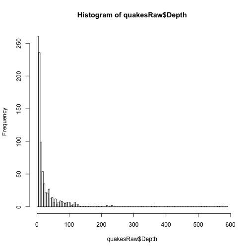 

```r
quantile(quakesRaw$Depth)
```

```
##     0%    25%    50%    75%   100% 
##   0.00   3.90   9.20  23.33 585.20
```

```r
hist(quakesRaw$Lat, breaks = 100)
```

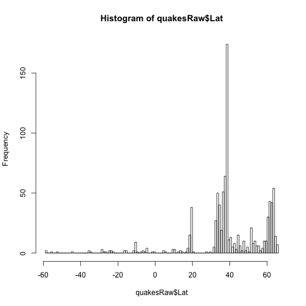 

```r
hist(quakesRaw$Lon, breaks = 100)
```

 


### Make some univariate tables

```r
table(quakesRaw$Src)
```

```
## 
##  ak  ci  hv  mb  nc  nm  nn  pr  se  us  uu  uw 
## 263 125  30   6 243   6  47  28   2  98  25  23
```

```r
table(quakesRaw$Version)
```

```
## 
##   0   1   2   3   4   5   6   7   8   9   A   B   C   D 
## 145 190 320  53  37  25  24  10  18  57  12   2   1   2
```

```r
table(quakesRaw$Region)
```

```
## 
##                                     Alaska Peninsula 
##                                                   14 
##          Andreanof Islands, Aleutian Islands, Alaska 
##                                                   19 
##                                             Arkansas 
##                                                    3 
##                                       Atacama, Chile 
##                                                    4 
##                              Baja California, Mexico 
##                                                   11 
##                                            Banda Sea 
##                                                    2 
##                               Bosnia and Herzegovina 
##                                                    1 
##                             British Columbia, Canada 
##                                                    3 
##                                       Central Alaska 
##                                                  108 
##                                   Central California 
##                                                   81 
##                                           Costa Rica 
##                                                    1 
##                                        Crete, Greece 
##                                                    1 
##                           Dodecanese Islands, Greece 
##                                                    1 
##                            Dominican Republic region 
##                                                    2 
##                                   eastern Kazakhstan 
##                                                    6 
##                               eastern Sichuan, China 
##                                                    1 
##                                    eastern Tennessee 
##                                                    1 
##                                        eastern Texas 
##                                                    2 
##                Fox Islands, Aleutian Islands, Alaska 
##                                                   13 
##                 Greater Los Angeles area, California 
##                                                   27 
##                                               Greece 
##                                                    1 
##                                          Guam region 
##                                                    1 
##                                            Guatemala 
##                                                    1 
##                                       Gulf of Alaska 
##                                                    1 
##                                   Gulf of California 
##                                                    1 
##                                Hawaii region, Hawaii 
##                                                    1 
##                               Hokkaido, Japan region 
##                                                    1 
##                             Island of Hawaii, Hawaii 
##                                                   29 
##                            Izu Islands, Japan region 
##                                                    1 
##                                     Jujuy, Argentina 
##                                                    1 
##                              Kenai Peninsula, Alaska 
##                                                   12 
##                               Kerkira region, Greece 
##                                                    1 
##                         Kodiak Island region, Alaska 
##                                                    6 
##                                        Kuril Islands 
##                                                    1 
##                                  La Rioja, Argentina 
##                                                    1 
##                         Lassen Peak area, California 
##                                                    1 
##                         Long Valley area, California 
##                                                    6 
##                                           Madagascar 
##                                                    1 
##                                Mindanao, Philippines 
##                                                    1 
##                    Mount St. Helens area, Washington 
##                                                    1 
##                          near the coast of Nicaragua 
##                                                    1 
##                      near the coast of southern Peru 
##                                                    1 
##                 near the east coast of Honshu, Japan 
##                                                    2 
##                near the south coast of Honshu, Japan 
##                                                    1 
##                      near the south coast of Myanmar 
##                                                    1 
## near the south coast of New Guinea, Papua New Guinea 
##                                                    1 
##                                               Nevada 
##                                                   32 
##                 New Britain region, Papua New Guinea 
##                                                    1 
##                         New Guinea, Papua New Guinea 
##                                                    1 
##                                           New Mexico 
##                                                    1 
##                            north of Ascension Island 
##                                                    1 
##                                      northern Alaska 
##                                                    7 
##                                  Northern California 
##                                                  157 
##                                       northern Idaho 
##                                                    1 
##                                       northern Italy 
##                                                    1 
##                              northern Qinghai, China 
##                                                    1 
##                          northern Sumatra, Indonesia 
##                                                    2 
##                       northwest of the Kuril Islands 
##                                                    1 
##                        Northwest Territories, Canada 
##                                                    2 
##                                    northwestern Iran 
##                                                    2 
##                              off the coast of Oregon 
##                                                    1 
##                 off the coast of Southeastern Alaska 
##                                                    1 
##                  off the east coast of Honshu, Japan 
##                                                    1 
##                          offshore Central California 
##                                                    1 
##                                 offshore El Salvador 
##                                                    1 
##                         offshore Northern California 
##                                                    3 
##                                      offshore Oregon 
##                                                    4 
##                        Olympic Peninsula, Washington 
##                                                    1 
##                                               Oregon 
##                                                    2 
##                      Panama-Costa Rica border region 
##                                                    1 
##                                     Papua, Indonesia 
##                                                    1 
##                            Philippine Islands region 
##                                                    4 
##                          Portland urban area, Oregon 
##                                                    1 
##                         Prince Edward Islands region 
##                                                    1 
##                                          Puerto Rico 
##                                                    5 
##                                   Puerto Rico region 
##                                                    8 
##                Rat Islands, Aleutian Islands, Alaska 
##                                                    7 
##                                Ryukyu Islands, Japan 
##                                                    1 
##                   San Francisco Bay area, California 
##                                                   19 
##                  San Juan Islands region, Washington 
##                                                    1 
##                                   Santa Cruz Islands 
##                                                   11 
##                         Santa Monica Bay, California 
##                                                    1 
##                                             Savu Sea 
##                                                    1 
##                Seattle-Tacoma urban area, Washington 
##                                                    1 
##                                       South Carolina 
##                                                    1 
##                                      south of Alaska 
##                                                    1 
##                            south of the Fiji Islands 
##                                                    3 
##                        South Sandwich Islands region 
##                                                    3 
##                          southeast of Shikoku, Japan 
##                                                    1 
##                                  Southeastern Alaska 
##                                                    5 
##                                southeastern Missouri 
##                                                    2 
##                                      Southern Alaska 
##                                                   69 
##                                  Southern California 
##                                                   76 
##                           southern East Pacific Rise 
##                                                    3 
##                                       southern Idaho 
##                                                    2 
##                          southern Mid-Atlantic Ridge 
##                                                    1 
##                                        southern Peru 
##                                                    2 
##                          southern Sumatra, Indonesia 
##                                                    2 
##                             southern Xinjiang, China 
##                                                    1 
##                     Southern Yukon Territory, Canada 
##                                                    1 
##                                  Sulawesi, Indonesia 
##                                                    1 
##                                           Tajikistan 
##                                                    1 
##                                            Tennessee 
##                                                    1 
##                                                Tonga 
##                                                    1 
##                         Unimak Island region, Alaska 
##                                                    2 
##                                                 Utah 
##                                                   15 
##                                Virgin Islands region 
##                                                   13 
##                                           Washington 
##                                                    9 
##                                         western Iran 
##                                                    1 
##                                      western Montana 
##                                                    4 
##                         Xizang-Qinghai border region 
##                                                    1 
##                   Yellowstone National Park, Wyoming 
##                                                    9
```

```r
length(unique(quakesRaw$NST))
```

```
## [1] 129
```

```r
length(unique(quakesRaw$Eqid))
```

```
## [1] 896
```


### Plot the earthquakes on the globe

```r
map("world")
points(quakesRaw$Lon, quakesRaw$Lat, pch = 19, col = "blue")
```

 


### Plot the earthquakes on the globe/sized by relative magnitude 

```r
map("world")
points(quakesRaw$Lon, quakesRaw$Lat, pch = 19, col = "blue", cex = quakesRaw$Magnitude/max(quakesRaw$Magnitude))
```

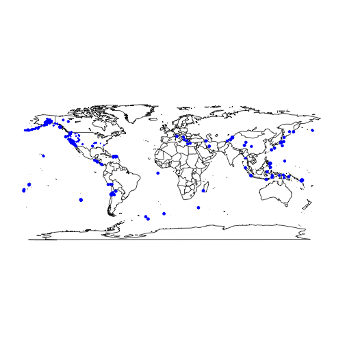 


### Plot the earthquakes on the globe/sized by relative depth

```r
map("world")
points(quakesRaw$Lon, quakesRaw$Lat, pch = 19, col = "blue", cex = quakesRaw$Depth/max(quakesRaw$Depth))
```

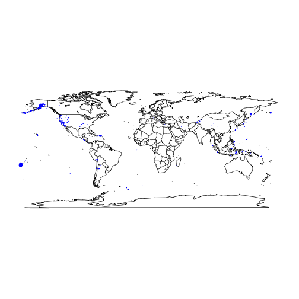 


### Plot depth versus magnitude

```r
plot(quakesRaw$Depth, quakesRaw$Magnitude, pch = 19)
```

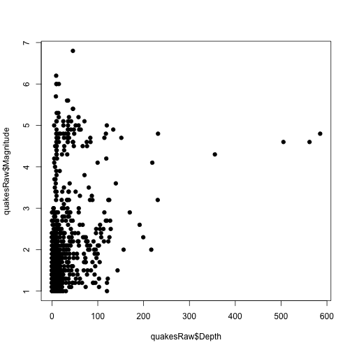 


### Looks weird, let's try a transform - need to add one to avoid log(0)

```r
summary(log10(quakesRaw$Depth), useNA = "ifany")
```

```
##    Min. 1st Qu.  Median    Mean 3rd Qu.    Max. 
##    -Inf       1       1    -Inf       1       3
```

```r
summary(log10(quakesRaw$Depth + 1))
```

```
##    Min. 1st Qu.  Median    Mean 3rd Qu.    Max. 
##    0.00    0.69    1.01    1.05    1.39    2.77
```

```r
quakesRaw$log10Depth <- log10(quakesRaw$Depth + 1)
```


### Plot w/transform

```r
plot(quakesRaw$log10Depth, quakesRaw$Magnitude, pch = 19)
```

 


### Color by Latitute 

```r
latCut = cut2(quakesRaw$Lat, g = 5)
plot(quakesRaw$log10Depth, quakesRaw$Magnitude, pch = 19, col = latCut)
```

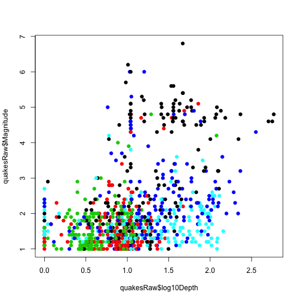 


Might be a lot of black in the top right quadrant

### Color by longitude 


```r
lonCut = cut2(quakesRaw$Lon, g = 5)
plot(quakesRaw$log10Depth, quakesRaw$Magnitude, pch = 19, col = lonCut)
```

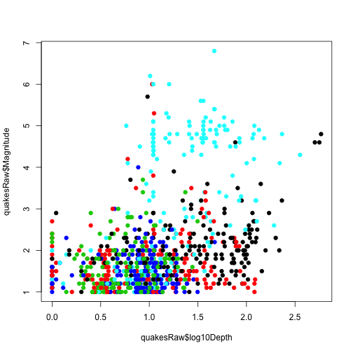 

Definitely a lot of light blue in the upper right hand quadrant


### Color by NST


```r
nstCut = cut2(quakesRaw$NST, g = 5)
plot(quakesRaw$log10Depth, quakesRaw$Magnitude, pch = 19, col = nstCut)
```

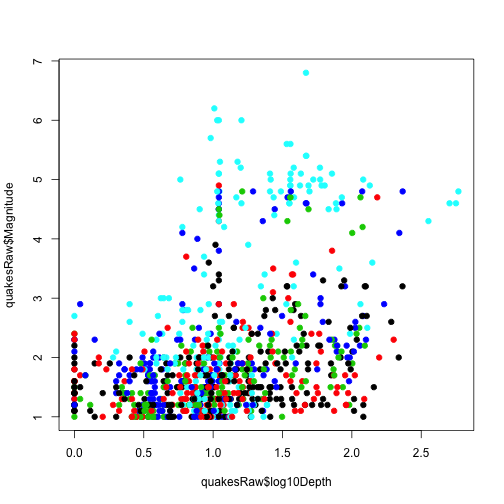 


### Check out relationship with Src

```r
boxplot(quakesRaw$log10Depth ~ quakesRaw$Src)
```

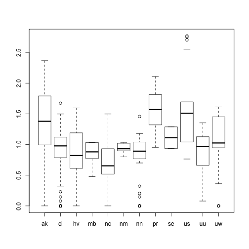 

```r
boxplot(quakesRaw$Magnitude ~ quakesRaw$Src)
```

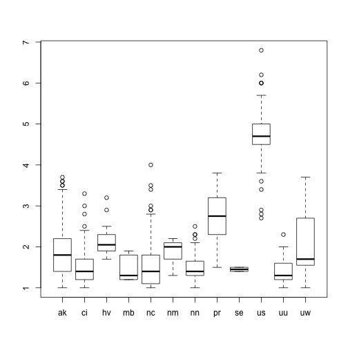 


### How do lat/lon correlated with source


```r

boxplot(quakesRaw$Lat ~ quakesRaw$Src)
```

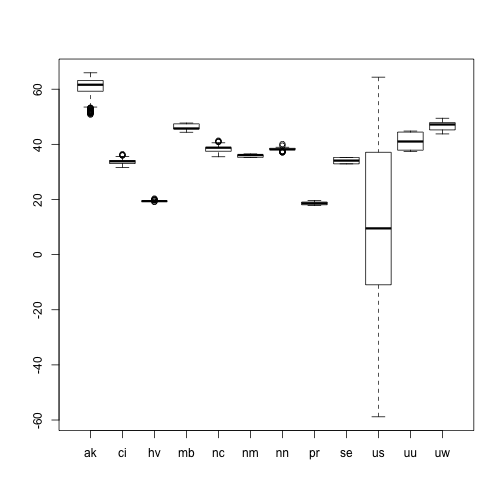 

```r
boxplot(quakesRaw$Lon ~ quakesRaw$Src)
```

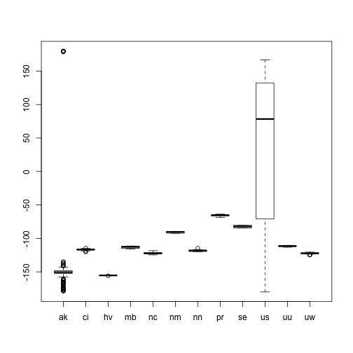 


### Get the formatted time, see earthquakes over time


```r
timeF = strptime(quakesRaw$Datetime, format = "%A, %B %e, %Y %H:%M:%S")
plot(timeF, quakesRaw$log10Depth)
```

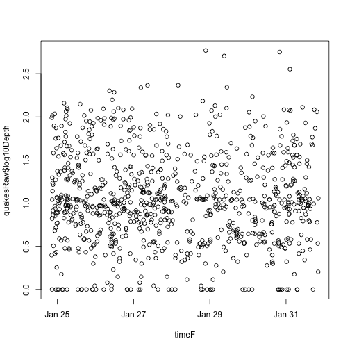 

```r
plot(timeF, quakesRaw$Magnitude)
```

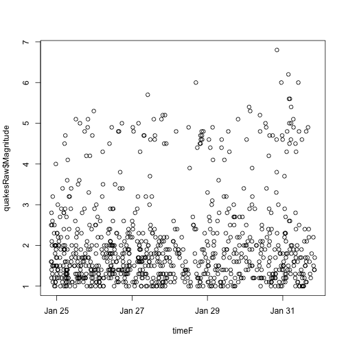 


------

## Modeling


## Fit a basic model relating depth to time


```r
lm1 <- lm(quakesRaw$Depth ~ quakesRaw$Magnitude)
summary(lm1)
```

```
## 
## Call:
## lm(formula = quakesRaw$Depth ~ quakesRaw$Magnitude)
## 
## Residuals:
##    Min     1Q Median     3Q    Max 
##  -69.5  -16.4   -8.6    0.0  525.0 
## 
## Coefficients:
##                     Estimate Std. Error t value Pr(>|t|)    
## (Intercept)            -3.17       3.06   -1.04      0.3    
## quakesRaw$Magnitude    13.20       1.32   10.03   <2e-16 ***
## ---
## Signif. codes:  0 '***' 0.001 '**' 0.01 '*' 0.05 '.' 0.1 ' ' 1 
## 
## Residual standard error: 43.6 on 894 degrees of freedom
## Multiple R-squared: 0.101,	Adjusted R-squared:  0.1 
## F-statistic:  101 on 1 and 894 DF,  p-value: <2e-16
```


## Plot the observed ('black') and fitted ('red') points


```r
lm1 <- lm(quakesRaw$Magnitude ~ quakesRaw$Depth)
plot(quakesRaw$Depth, quakesRaw$Magnitude, pch = 19)
points(quakesRaw$Depth, lm1$fitted, pch = 19, col = "red")
```

 


## Look at residuals versus observations, residuals versus fitted values


```r
lm1 <- lm(quakesRaw$Magnitude ~ quakesRaw$Depth)
par(mfrow = c(1, 2))
plot(quakesRaw$Depth, lm1$residuals, pch = 19)
plot(lm1$fitted, lm1$residuals, pch = 19)
```

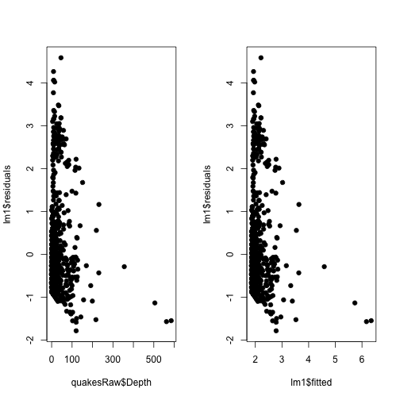 


## Try the transform


```r
lm2 <- lm(quakesRaw$Magnitude ~ quakesRaw$log10Depth)
plot(quakesRaw$log10Depth, quakesRaw$Magnitude, pch = 19)
points(quakesRaw$log10Depth, lm2$fitted, pch = 19, col = "red")
```

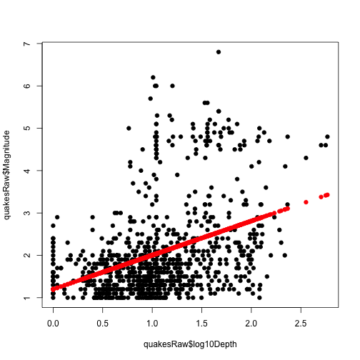 


## Plot the residuals versus the observed and fitted (little better here)


```r
lm2 <- lm(quakesRaw$Magnitude ~ quakesRaw$log10Depth)
par(mfrow = c(1, 2))
plot(quakesRaw$log10Depth, lm2$residuals, pch = 19)
plot(lm2$fitted, lm2$residuals, pch = 19)
```

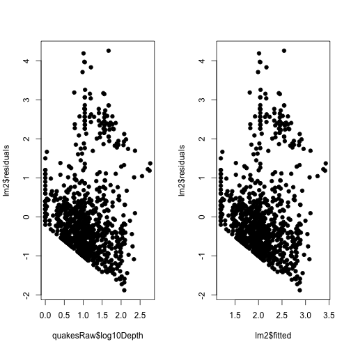 


## What if we color residuals by lat (see a pattern)


```r
lm2 <- lm(quakesRaw$Magnitude ~ quakesRaw$log10Depth)
latCut = cut2(quakesRaw$Lat, g = 5)
par(mfrow = c(1, 2))
plot(quakesRaw$log10Depth, lm2$residuals, pch = 19, col = latCut)
plot(lm2$fitted, lm2$residuals, pch = 19, col = latCut)
```

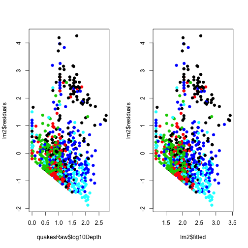 


## What if we color residuals by lon (see a pattern)


```r
lm2 <- lm(quakesRaw$Magnitude ~ quakesRaw$log10Depth)
lonCut = cut2(quakesRaw$Lon, g = 5)
par(mfrow = c(1, 2))
plot(quakesRaw$log10Depth, lm2$residuals, pch = 19, col = lonCut)
plot(lm2$fitted, lm2$residuals, pch = 19, col = lonCut)
```

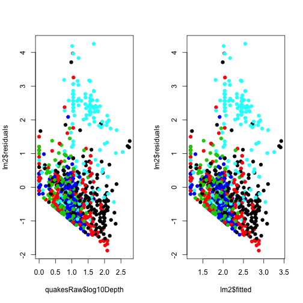 


## Now try fitting a new model with Lat in there


```r
latCut = cut2(quakesRaw$Lat, g = 5)
lm3 <- lm(quakesRaw$Magnitude ~ quakesRaw$log10Depth + latCut)
par(mfrow = c(1, 2))
plot(quakesRaw$log10Depth, lm3$residuals, pch = 19, col = latCut)
plot(lm3$fitted, lm3$residuals, pch = 19, col = latCut)
```

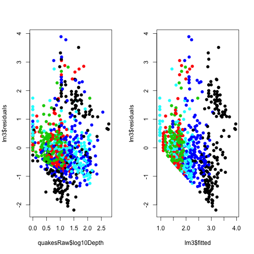 


## How about Lat/Lon


```r
latCut = cut2(quakesRaw$Lat, g = 5)
lonCut = cut2(quakesRaw$Lon, g = 5)
lm4 <- lm(quakesRaw$Magnitude ~ quakesRaw$log10Depth + latCut + lonCut)
par(mfrow = c(1, 2))
plot(quakesRaw$log10Depth, lm4$residuals, pch = 19, col = latCut)
plot(lm4$fitted, lm4$residuals, pch = 19, col = latCut)
```

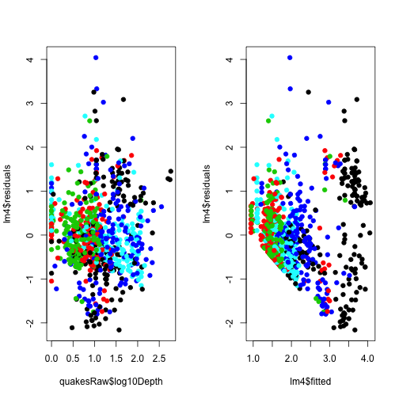 


## Color that model by NST


```r
latCut = cut2(quakesRaw$Lat, g = 5)
lonCut = cut2(quakesRaw$Lon, g = 5)
nstCut = cut2(quakesRaw$NST, g = 5)
lm4 <- lm(quakesRaw$Magnitude ~ quakesRaw$log10Depth + latCut + lonCut)
par(mfrow = c(1, 2))
plot(quakesRaw$log10Depth, lm4$residuals, pch = 19, col = nstCut)
plot(lm4$fitted, lm4$residuals, pch = 19, col = nstCut)
```

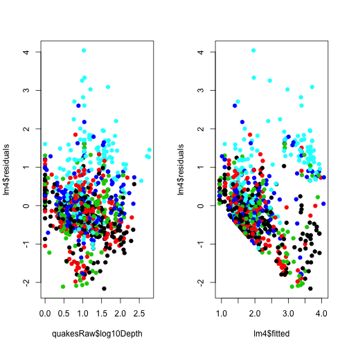 


## Include NST 


```r
latCut = cut2(quakesRaw$Lat, g = 5)
lonCut = cut2(quakesRaw$Lon, g = 5)
nstCut = cut2(quakesRaw$NST, g = 5)
lm5 <- lm(quakesRaw$Magnitude ~ quakesRaw$log10Depth + latCut + lonCut + nstCut)
par(mfrow = c(1, 2))
plot(quakesRaw$log10Depth, lm5$residuals, pch = 19, col = nstCut)
plot(lm5$fitted, lm5$residuals, pch = 19, col = nstCut)
```

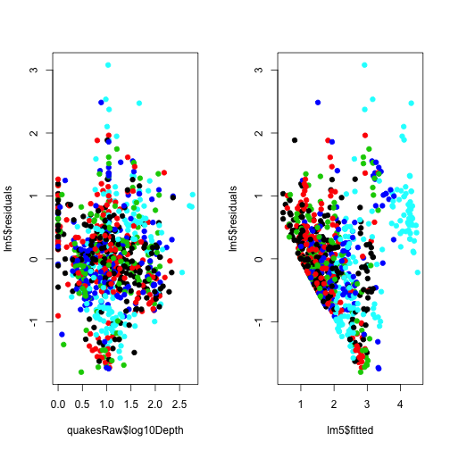 


## Let's use model 5


```r
summary(lm5)
```

```
## 
## Call:
## lm(formula = quakesRaw$Magnitude ~ quakesRaw$log10Depth + latCut + 
##     lonCut + nstCut)
## 
## Residuals:
##     Min      1Q  Median      3Q     Max 
## -1.8019 -0.4208 -0.0272  0.3952  3.0816 
## 
## Coefficients:
##                      Estimate Std. Error t value Pr(>|t|)    
## (Intercept)            1.5252     0.1188   12.84  < 2e-16 ***
## quakesRaw$log10Depth   0.3446     0.0537    6.42  2.2e-10 ***
## latCut[ 33.8,37.6)    -0.3722     0.0903   -4.12  4.1e-05 ***
## latCut[ 37.6,38.8)    -0.1670     0.0956   -1.75   0.0810 .  
## latCut[ 38.8,60.2)    -0.1131     0.0865   -1.31   0.1915    
## latCut[ 60.2,66.0]    -0.3329     0.1043   -3.19   0.0015 ** 
## lonCut[-150,-123)     -0.1485     0.0824   -1.80   0.0721 .  
## lonCut[-123,-120)     -0.4052     0.0980   -4.13  3.9e-05 ***
## lonCut[-120,-116)     -0.6875     0.1001   -6.87  1.2e-11 ***
## lonCut[-116, 180]      0.9253     0.0878   10.54  < 2e-16 ***
## nstCut[11, 16)         0.1280     0.0728    1.76   0.0790 .  
## nstCut[16, 24)         0.1869     0.0749    2.50   0.0127 *  
## nstCut[24, 40)         0.5379     0.0752    7.15  1.8e-12 ***
## nstCut[40,598]         1.3000     0.0777   16.73  < 2e-16 ***
## ---
## Signif. codes:  0 '***' 0.001 '**' 0.01 '*' 0.05 '.' 0.1 ' ' 1 
## 
## Residual standard error: 0.708 on 882 degrees of freedom
## Multiple R-squared: 0.598,	Adjusted R-squared: 0.592 
## F-statistic:  101 on 13 and 882 DF,  p-value: <2e-16
```

```r
confint(lm5)
```

```
##                         2.5 %   97.5 %
## (Intercept)           1.29216  1.75831
## quakesRaw$log10Depth  0.23927  0.44990
## latCut[ 33.8,37.6)   -0.54940 -0.19506
## latCut[ 37.6,38.8)   -0.35464  0.02065
## latCut[ 38.8,60.2)   -0.28284  0.05669
## latCut[ 60.2,66.0]   -0.53757 -0.12825
## lonCut[-150,-123)    -0.31026  0.01335
## lonCut[-123,-120)    -0.59758 -0.21274
## lonCut[-120,-116)    -0.88399 -0.49095
## lonCut[-116, 180]     0.75302  1.09759
## nstCut[11, 16)       -0.01484  0.27076
## nstCut[16, 24)        0.03993  0.33388
## nstCut[24, 40)        0.39032  0.68556
## nstCut[40,598]        1.14743  1.45252
```


## Let's plot fitted versus observed magnitudes on the map


```r
par(mfrow = c(2, 1))
map("world")
lm5fitted <- lm5$fitted
points(quakesRaw$Lon, quakesRaw$Lat, pch = 19, col = "blue", cex = lm5fitted/max(lm5fitted))
map("world")
points(quakesRaw$Lon, quakesRaw$Lat, pch = 19, col = "blue", cex = quakesRaw$Magnitude/max(quakesRaw$Magnitude))
```

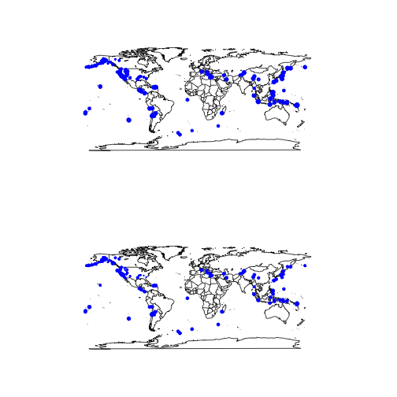 


